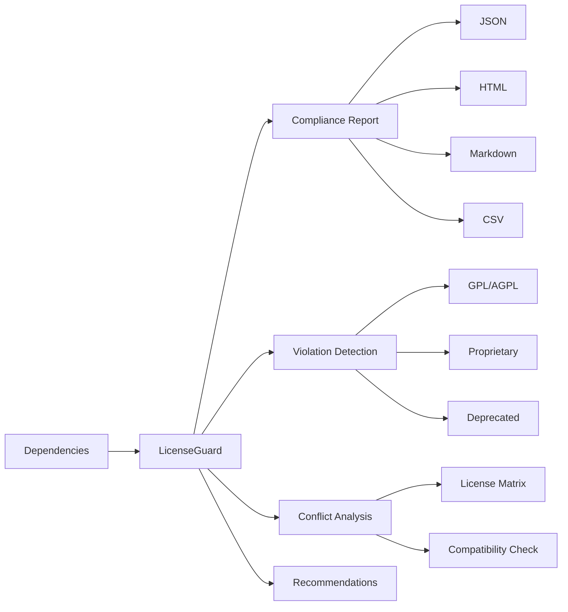

# LicenseGuard - Enterprise Dependency License Compliance Scanner

[](https://github.com/moggan1337/LicenseGuard/actions/workflows/ci.yml)

<div align="center">


[](https://badge.fury.io/js/licenseguard)
[](https://opensource.org/licenses/MIT)
[](https://github.com/moggan1337/LicenseGuard/actions)
[](CONTRIBUTING.md)

**Enterprise-grade dependency license compliance scanner with policy enforcement, automated negotiation, and CI/CD integration.**

[Features](#features) • [Installation](#installation) • [Quick Start](#quick-start) • [Documentation](#documentation) • [CI/CD Integration](#cicd-integration) • [Contributing](#contributing)

</div>

---

## 🎬 Demo


*Dependency license compliance scanning*

## Screenshots
| Component | Preview |
|-----------|---------|
| Scan Results |  |
| Policy Dashboard |  |
| Violation Report |  |

## Visual Description
Scan results show dependency tree with license badges. Policy dashboard displays configured rules and exceptions. Violation report highlights non-compliant licenses with remediation.

---


## Table of Contents

1. [Overview](#overview)
2. [Features](#features)
3. [Why LicenseGuard?](#why-licenseguard)
4. [Installation](#installation)
5. [Quick Start](#quick-start)
6. [Command Line Interface](#command-line-interface)
7. [Configuration](#configuration)
8. [API Reference](#api-reference)
9. [CI/CD Integration](#cicd-integration)
10. [License Compliance Guide](#license-compliance-guide)
11. [Open Source Governance](#open-source-governance)
12. [Troubleshooting](#troubleshooting)
13. [FAQ](#faq)
14. [Contributing](#contributing)
15. [License](#license)

---

## Overview

LicenseGuard is a comprehensive tool for managing open source license compliance in software projects. It analyzes your dependency tree, detects license conflicts, identifies GPL/AGPL violations, and generates detailed compliance reports.

In today's software development landscape, projects rely on hundreds of open source packages. Each package comes with its own license, and understanding the legal implications of combining different licenses is crucial for:

- **Legal Compliance**: Avoiding license violations that could result in lawsuits or forced code disclosure
- **Risk Management**: Understanding the legal risks associated with your dependency choices
- **Corporate Governance**: Meeting enterprise compliance requirements and audit needs
- **Open Source Strategy**: Making informed decisions about open source adoption

### What LicenseGuard Does



---

## Features

### Core Functionality

| Feature | Description |
|---------|-------------|
| **SPDX License Detection** | Automatically identifies and normalizes 50+ SPDX license identifiers |
| **License Compatibility Matrix** | Determines compatibility between any two licenses with detailed reasoning |
| **GPL/AGPL Violation Detection** | Identifies potential derivative work issues and network copyleft triggers |
| **License Conflict Resolution** | Detects and suggests resolutions for license conflicts |
| **Copyright Header Enforcement** | Scans and validates copyright headers in source files |
| **Dependency Tree Visualization** | Interactive tree view with license information at each node |
| **Custom Policy Rules** | Define your own compliance rules based on your organization's needs |
| **Automated License Negotiation** | Generates negotiation letters and suggests package alternatives |
| **Compliance Report Export** | Export reports in JSON, HTML, Markdown, CSV, and SPDX formats |
| **CI/CD Policy Gates** | Integrate compliance checks into your CI/CD pipeline |

### Supported Licenses

LicenseGuard supports all major open source licenses including:

- **Permissive**: MIT, Apache-2.0, BSD-2-Clause, BSD-3-Clause, ISC, Zlib, BSL-1.0, Unlicense, CC0-1.0
- **Weak Copyleft**: LGPL-2.1, LGPL-3.0, MPL-2.0, EPL-1.0, EPL-2.0, CDDL-1.0, OSL-3.0
- **Strong Copyleft**: GPL-2.0, GPL-3.0, AGPL-3.0, EUPL-1.2
- **Public Domain**: Unlicense, CC0-1.0, WTFPL
- **Creative Commons**: CC-BY-4.0, CC-BY-SA-4.0, CC-BY-NC-4.0
- **Proprietary**: Custom/proprietary licenses

---

## Why LicenseGuard?

### The License Compliance Problem

Every year, companies face legal challenges related to open source license compliance:

1. **Hidden Costs**: GPL violations can force source code disclosure
2. **Audit Failures**: Missing compliance documentation during due diligence
3. **License Conflicts**: Incompatible licenses in the same codebase
4. **Dependency Chains**: Transitive dependencies with unknown licenses

### How LicenseGuard Helps

```
┌─────────────────────────────────────────────────────────────────┐
│                    WITHOUT LicenseGuard                          │
├─────────────────────────────────────────────────────────────────┤
│  • Unknown license risks in dependencies                        │
│  • Manual license research for each package                      │
│  • Reactive compliance (problems found during audit)             │
│  • No visibility into license conflicts                         │
│  • Manual report generation                                      │
│  • No CI/CD integration                                         │
└─────────────────────────────────────────────────────────────────┘

┌─────────────────────────────────────────────────────────────────┐
│                    WITH LicenseGuard                            │
├─────────────────────────────────────────────────────────────────┤
│  • Automated license detection and classification               │
│  • Instant compatibility analysis                               │
│  • Proactive compliance (problems found during development)    │
│  • Conflict detection and resolution suggestions                │
│  • Automated report generation in multiple formats              │
│  • Native CI/CD integration                                     │
└─────────────────────────────────────────────────────────────────┘
```

---

## Installation

### Prerequisites

- Node.js >= 18.0.0
- npm or yarn

### Global Installation (Recommended)

```bash
npm install -g licenseguard
```

### Local Installation

```bash
npm install --save-dev licenseguard
```

### Using npx (No Installation)

```bash
npx licenseguard scan
```

### Verify Installation

```bash
licenseguard --version
# Output: licenseguard v1.0.0
```

---

## Quick Start

### 1. Scan Your Project

```bash
# Basic scan
licenseguard scan

# Scan with detailed output
licenseguard scan --output report.md --format markdown

# Scan and fail on errors
licenseguard scan --fail-on-errors
```

### 2. View Dependency Tree

```bash
# Show dependency tree with licenses
licenseguard tree

# Show only specific license type
licenseguard tree --filter-license MIT

# Show copyleft licenses only
licenseguard tree --filter-category copyleft-strong
```

### 3. Check for Conflicts

```bash
# Check for license conflicts
licenseguard conflict

# Check with specific project license
licenseguard conflict --project-license Apache-2.0
```

### 4. Check GPL/AGPL Violations

```bash
# Standard check
licenseguard gpl

# Network service check (triggers AGPL rules)
licenseguard gpl --network-service
```

---

## Command Line Interface

### Global Options

| Option | Description |
|--------|-------------|
| `-v, --verbose` | Enable verbose output |
| `-q, --quiet` | Suppress non-essential output |

### scan

Scans project dependencies for license compliance.

```bash
licenseguard scan [options]
```

**Options:**

| Option | Description | Default |
|--------|-------------|---------|
| `-p, --project <path>` | Project root path | Current directory |
| `-o, --output <path>` | Output file path | None |
| `-f, --format <format>` | Output format | markdown |
| `--include-dev` | Include dev dependencies | false |
| `--include-optional` | Include optional dependencies | false |
| `--max-depth <number>` | Maximum dependency depth | 10 |
| `--policy <name>` | Policy name to use | default |
| `--project-license <license>` | Project license | MIT |
| `--network-service` | Mark as network service | false |
| `--fail-on-errors` | Exit with error on violations | false |

**Output Formats:** `json`, `html`, `markdown`, `csv`, `xml`, `spdx-json`, `spdx-tag-value`

### tree

Displays dependency tree with license information.

```bash
licenseguard tree [options]
```

**Options:**

| Option | Description | Default |
|--------|-------------|---------|
| `-p, --project <path>` | Project root path | Current directory |
| `--show-versions` | Show package versions | true |
| `--show-licenses` | Show license identifiers | true |
| `--max-depth <number>` | Maximum display depth | 3 |
| `--filter-license <license>` | Filter by license | None |
| `--filter-category <category>` | Filter by category | None |

### check

Checks license information for a specific package.

```bash
licenseguard check <package>
```

### licenses

Lists all supported SPDX licenses.

```bash
licenseguard licenses [options]
```

**Options:**

| Option | Description |
|--------|-------------|
| `-c, --category <category>` | Filter by category |
| `--osi-only` | Show only OSI approved licenses |

### conflict

Checks for license conflicts in dependencies.

```bash
licenseguard conflict [options]
```

### gpl

Checks for GPL/AGPL license violations.

```bash
licenseguard gpl [options]
```

**Options:**

| Option | Description |
|--------|-------------|
| `--network-service` | Mark as network service |

### copyright

Checks copyright headers in source files.

```bash
licenseguard copyright [options]
```

**Options:**

| Option | Description |
|--------|-------------|
| `-p, --path <path>` | Directory or file path |
| `-r, --recursive` | Scan recursively |
| `--fix` | Automatically fix missing headers |
| `--year <year>` | Copyright year |
| `--holder <name>` | Copyright holder name |
| `--license <license>` | License for headers |

### stats

Shows dependency statistics.

```bash
licenseguard stats [options]
```

### negotiate

Generates license negotiation documents.

```bash
licenseguard negotiate [options]
```

**Options:**

| Option | Description |
|--------|-------------|
| `-f, --from <license>` | Current license |
| `-t, --to <license>` | Target license |
| `-p, --package <name>` | Package name |
| `--output <path>` | Output file path |

---

## Configuration

### Configuration File

Create a `.licenseguardrc` file in your project root:

```json
{
  "policy": {
    "name": "company-policy",
    "version": "1.0.0",
    "rules": [
      {
        "id": "block-agpl",
        "enabled": true,
        "severity": "error",
        "action": "deny",
        "licenses": ["AGPL-3.0"]
      },
      {
        "id": "prefer-permissive",
        "enabled": true,
        "severity": "warning",
        "action": "warn",
        "category": "copyleft-strong"
      }
    ],
    "settings": {
      "allowDeprecatedLicenses": false,
      "requireOSIApproval": true,
      "checkLicenseCompatibility": true,
      "detectGPLViolations": true,
      "maxLicenseRiskScore": 50,
      "blockedLicenses": ["AGPL-3.0", "Proprietary"]
    }
  },
  "exceptions": [
    {
      "packageName": "some-package",
      "license": "GPL-3.0",
      "reason": "Internal use only, not distributed",
      "approvedBy": "legal@company.com",
      "expiresAt": "2025-12-31"
    }
  ],
  "project": {
    "name": "my-project",
    "license": "MIT",
    "isNetworkService": false
  }
}
```

### Environment Variables

| Variable | Description |
|----------|-------------|
| `LICENSEGUARD_POLICY` | Policy file path |
| `LICENSEGUARD_OUTPUT` | Default output path |
| `LICENSEGUARD_FORMAT` | Default output format |
| `NPM_REGISTRY` | Custom npm registry |

---

## API Reference

### JavaScript/TypeScript API

```typescript
import { LicenseGuardAPI, quickScan } from 'licenseguard';

// Using the API class
const api = new LicenseGuardAPI('/path/to/project');

// Run full scan
const report = await api.scan();
console.log(`Compliance Score: ${report.summary.score}`);

// Check specific compatibility
const compatibility = api.checkCompatibility('MIT', 'GPL-3.0');
console.log(`Compatible: ${compatibility.compatible}`);

// Generate report
const html = await api.generateReport('html');

// Quick scan
const quickReport = await quickScan('/path/to/project', {
  projectLicense: 'MIT',
  failOnErrors: true
});
```

### Core Functions

#### LicenseDetector

```typescript
import { LicenseDetector } from 'licenseguard';

// Detect license from string
const info = LicenseDetector.detect('MIT OR Apache-2.0');
console.log(info.spdxId, info.category, info.osiApproved);

// Get license category
const category = LicenseDetector.getCategory('GPL-3.0');
// Returns: 'copyleft-strong'

// Check if OSI approved
const isOSIApproved = LicenseDetector.isOSIApproved('MIT');
// Returns: true

// Get risk score (0-100)
const riskScore = LicenseDetector.getRiskScore('AGPL-3.0');
// Returns: 80
```

#### CompatibilityMatrix

```typescript
import { CompatibilityMatrix } from 'licenseguard';

// Check compatibility between two licenses
const result = CompatibilityMatrix.checkCompatibility('MIT', 'GPL-3.0');
console.log(result.compatible); // true

// Check all licenses for conflicts
const { compatible, conflicts } = CompatibilityMatrix.checkAllCompatible([
  'MIT', 'Apache-2.0', 'GPL-3.0'
]);

// Get compatible alternatives
const alternatives = CompatibilityMatrix.getCompatibleLicenses('GPL-3.0');

// Generate negotiation offer
const offer = CompatibilityMatrix.generateNegotiationOffer('GPL-3.0', 'MIT');
```

#### GPLDetector

```typescript
import { GPLDetector } from 'licenseguard';

// Detect GPL violations
const violations = GPLDetector.detectViolations(dependencies, 'MIT', false);

// Calculate risk score
const score = GPLDetector.calculateRiskScore(dependencies, isNetworkService);

// Generate recommendations
const recommendations = GPLDetector.generateRecommendations(dependencies, projectLicense);
```

### Report Generation

```typescript
import { ReportGenerator } from 'licenseguard';

// Generate report in various formats
await ReportGenerator.generate(report, 'json', 'report.json');
await ReportGenerator.generate(report, 'html', 'report.html');
await ReportGenerator.generate(report, 'markdown', 'report.md');
await ReportGenerator.generate(report, 'csv', 'report.csv');
await ReportGenerator.generate(report, 'spdx-json', 'report.spdx.json');

// Generate as string
const html = ReportGenerator.generateString(report, 'html');
```

---

## CI/CD Integration

### GitHub Actions

Add this to your workflow file (`.github/workflows/license.yml`):

```yaml
name: License Compliance

on:
  push:
    branches: [ main ]
  pull_request:

jobs:
  license-check:
    runs-on: ubuntu-latest
    steps:
      - uses: actions/checkout@v4
      - uses: actions/setup-node@v4
        with:
          node-version: '20'
      - run: npm ci
      - run: npx licenseguard scan --fail-on-errors
```

### GitLab CI

Add to `.gitlab-ci.yml`:

```yaml
license_compliance:
  stage: test
  image: node:20-alpine
  script:
    - npm ci
    - npx licenseguard scan --output license-report.json
  artifacts:
    paths:
      - license-report.json
```

### Jenkins

Add to your `Jenkinsfile`:

```groovy
pipeline {
    stages {
        stage('License Compliance') {
            steps {
                sh 'npx licenseguard scan --output report.json'
            }
            post {
                always {
                    archiveArtifacts artifacts: 'report.json'
                }
            }
        }
    }
}
```

### Azure DevOps

Add to your `azure-pipelines.yml`:

```yaml
- stage: LicenseCheck
  jobs:
    - job: LicenseScan
      steps:
        - task: NodeTool@0
          inputs:
            versionSpec: '20.x'
        - script: |
            npm ci
            npx licenseguard scan --output $(Build.StagingDirectory)/report.json
```

### Generating CI Configuration

LicenseGuard can generate CI configuration files:

```bash
# Generate GitHub Actions workflow
licenseguard ci github --output .github/workflows/license.yml

# Generate GitLab CI config
licenseguard ci gitlab --output .gitlab-ci.yml

# Generate Jenkinsfile
licenseguard ci jenkins --output Jenkinsfile
```

---

## License Compliance Guide

### Understanding License Categories

#### Permissive Licenses (Low Risk)

**Characteristics:**
- Minimal restrictions on how you can use the code
- No requirement to release source code
- Can be combined with proprietary code

**Examples:** MIT, Apache-2.0, BSD-3-Clause, ISC

**Usage:** Generally safe to use in any project type.

#### Weak Copyleft (Medium Risk)

**Characteristics:**
- Requires derivative works to be released under same license
- Allows linking (static or dynamic) with exceptions
- More flexible than strong copyleft

**Examples:** LGPL-3.0, MPL-2.0, EPL-2.0

**Usage:** Suitable for libraries that may be used by proprietary software.

#### Strong Copyleft (High Risk)

**Characteristics:**
- Requires entire combined work to be released under same license
- No linking exception for proprietary code
- May require source code disclosure

**Examples:** GPL-2.0, GPL-3.0, AGPL-3.0

**Usage:** Best for projects that are themselves open source.

#### Network Copyleft (Critical Risk)

**Characteristics:**
- Triggers obligations when software runs on a network
- Network access may constitute "distribution"
- Strictest copyleft requirements

**Examples:** AGPL-3.0

**Usage:** Avoid in proprietary SaaS/network services.

### Common License Combinations

| Your License | Dependency License | Compatible | Notes |
|--------------|-------------------|------------|-------|
| MIT | MIT | ✅ Yes | No restrictions |
| MIT | Apache-2.0 | ✅ Yes | Patent grants included |
| MIT | GPL-3.0 | ✅ Yes | MIT code can be in GPL project |
| Proprietary | MIT | ✅ Yes | No issues |
| Proprietary | GPL-3.0 | ❌ No | Cannot link proprietary code |
| Proprietary | LGPL-3.0 | ⚠️ Conditional | Dynamic linking OK |
| Proprietary | AGPL-3.0 | ❌ No | Network use triggers AGPL |

### GPL/AGPL Compliance Best Practices

#### For Proprietary Projects

1. **Avoid Strong Copyleft** dependencies
2. **Prefer Permissive** licenses (MIT, Apache, BSD)
3. **Use LGPL Carefully** - dynamic linking only
4. **Audit Transitive Dependencies** - indirect GPL inclusion
5. **Document All Exceptions** - maintain compliance records

#### For Open Source Projects

1. **Choose Compatible Licenses** - GPL projects can use MIT/Apache
2. **Be Aware of Version Conflicts** - GPL-2.0 vs GPL-3.0 matters
3. **Consider License Compatibility** - dual licensing options
4. **Include License Files** - maintain proper attribution
5. **Consider Upstream Contribution** - help make dependencies more permissive

#### For Network Services

1. **Avoid AGPL** unless you're prepared for source disclosure
2. **Review SaaS Clauses** in other licenses
3. **Consider Commercial Licensing** for AGPL dependencies
4. **Document Network Usage** - audit trail for compliance

### License Compatibility Matrix

```
                    Proprietary  GPL-3.0  LGPL-3.0  AGPL-3.0  MIT  Apache-2.0
Proprietary              ⚠️          ❌         ⚠️         ❌      ✅       ✅
GPL-3.0                  ❌          ✅         ✅         ✅      ✅       ✅
LGPL-3.0                 ⚠️          ✅         ✅         ✅      ✅       ✅
AGPL-3.0                 ❌          ✅         ✅         ⚠️      ✅       ✅
MIT                      ✅          ✅         ✅         ✅      ✅       ✅
Apache-2.0               ✅          ✅         ✅         ✅      ✅       ✅

✅ Compatible    ❌ Incompatible    ⚠️ Conditional
```

---

## Open Source Governance

### Building an Open Source Compliance Program

#### 1. Establish a Policy

Create a formal open source policy that defines:

- **Scope**: What projects and code are covered
- **Approved Licenses**: Which licenses are allowed
- **Prohibited Licenses**: Which licenses are blocked
- **Procedures**: How to request exceptions
- **Responsibilities**: Who is responsible for compliance

#### 2. Create a License Allowlist

```json
{
  "allowed": [
    "MIT",
    "Apache-2.0",
    "BSD-2-Clause",
    "BSD-3-Clause",
    "ISC",
    "Zlib",
    "BSL-1.0",
    "Unlicense",
    "CC0-1.0",
    "0BSD"
  ],
  "requiresApproval": [
    "GPL-2.0",
    "GPL-3.0",
    "LGPL-2.1",
    "LGPL-3.0",
    "MPL-2.0",
    "EPL-2.0"
  ],
  "prohibited": [
    "AGPL-3.0",
    "SSPL-1.0",
    "Proprietary"
  ]
}
```

#### 3. Implement Automated Checking

Integrate LicenseGuard into your development workflow:

```yaml
# Pre-commit hook (.husky/pre-commit)
npx licenseguard scan --fail-on-errors

# CI/CD Pipeline
- name: License Check
  run: npx licenseguard scan --fail-on-errors
```

#### 4. Maintain an Exception Process

Track exceptions with:

- Package name and version
- License in question
- Business justification
- Approval authority
- Expiration date
- Renewal process

#### 5. Regular Audits

- **Monthly**: Automated scanning
- **Quarterly**: Manual review of exceptions
- **Annually**: Full compliance audit
- **Per Release**: Pre-release verification

### Corporate Open Source Best Practices

1. **Educate Developers**
   - License basics training
   - Recognition of license types
   - Understanding obligations

2. **Provide Tooling**
   - IDE plugins for license hints
   - Automated scanning in CI/CD
   - Easy exception requests

3. **Create Clear Processes**
   - Exception request workflow
   - Approval timelines
   - Appeal process

4. **Document Everything**
   - License inventory
   - Exception rationale
   - Compliance decisions

5. **Monitor Dependencies**
   - Track new versions
   - Watch for license changes
   - Update compliance data

### Security Considerations

- **License Changes**: Some packages change licenses in new versions
- **Supply Chain Attacks**: Malicious packages may disguise licenses
- **License Proliferation**: Complex dependency trees increase risk
- **Attribution Requirements**: Missing credits can cause issues

---

## Troubleshooting

### Common Issues

#### "Unable to determine license"

**Cause:** Package doesn't have a valid license field.

**Solutions:**
1. Check the package's README or LICENSE file
2. Look up the package on npm/GitHub
3. Add exception in your policy configuration
4. Report issue to package maintainer

#### "GPL violation detected"

**Cause:** Strong copyleft license combined with proprietary code.

**Solutions:**
1. Replace with permissive alternative
2. Obtain commercial license
3. Change your project license to GPL-compatible
4. Use dynamic linking with LGPL version

#### "License compatibility check failed"

**Cause:** Incompatible licenses in your dependency tree.

**Solutions:**
1. Review the compatibility matrix
2. Find alternative packages
3. Request license upgrade from maintainer
4. Document exception with legal approval

#### "Exit code 1 on CI"

**Cause:** LicenseGuard found errors and `--fail-on-errors` is enabled.

**Solutions:**
1. Review the error report
2. Fix violations or add exceptions
3. Consult legal if unsure
4. Temporarily disable gate (not recommended)

### Debug Mode

Run with verbose output:

```bash
licenseguard scan --verbose
```

### Getting Help

- GitHub Issues: https://github.com/moggan1337/LicenseGuard/issues
- Documentation: https://licenseguard.app/docs
- Discord: https://discord.gg/licenseguard

---

## FAQ

### Q: Does LicenseGuard provide legal advice?

**A:** No. LicenseGuard is a tool that helps identify and analyze license compliance issues, but it does not constitute legal advice. For legal questions, consult with a qualified attorney.

### Q: Can LicenseGuard guarantee compliance?

**A:** No tool can guarantee 100% compliance. LicenseGuard helps identify potential issues, but ultimate responsibility lies with your organization to ensure proper licensing.

### Q: What happens if a package has no license?

**A:** Packages without licenses are by default copyright-protected. Using such packages without explicit permission may be illegal. LicenseGuard flags these as "Unknown" with high risk.

### Q: Can I use LicenseGuard for AGPL compliance?

**A:** LicenseGuard can detect AGPL dependencies, but AGPL compliance is complex and depends on your specific use case. Consult legal counsel for AGPL compliance questions.

### Q: Does LicenseGuard check transitive dependencies?

**A:** Yes. LicenseGuard analyzes the entire dependency tree including transitive dependencies, as these can affect your compliance status.

### Q: How often should I run LicenseGuard?

**A:** We recommend running on every build (CI/CD), at least weekly on main branches, and before any release.

### Q: Can I customize the compliance rules?

**A:** Yes. LicenseGuard supports custom policy rules, allowlists, blocklists, and exceptions to fit your organization's needs.

---

## Contributing

Contributions are welcome! Please read our contributing guidelines before submitting PRs.

### Development Setup

```bash
# Clone the repository
git clone https://github.com/moggan1337/LicenseGuard.git
cd LicenseGuard

# Install dependencies
npm install

# Run tests
npm test

# Build
npm run build

# Link for local testing
npm link
```

### Code Style

- Use TypeScript for all new code
- Follow ESLint and Prettier configurations
- Write tests for new features
- Update documentation for API changes

### Pull Request Process

1. Fork the repository
2. Create a feature branch
3. Make your changes
4. Add tests
5. Submit a pull request

### Reporting Issues

Please report bugs and feature requests via GitHub Issues.

---

## License

MIT License - see [LICENSE](LICENSE) for details.

---

## Acknowledgments

- SPDX Project for license identifiers
- Open Source Initiative for license definitions
- All contributors and users of LicenseGuard

---

<div align="center">

**Made with ❤️ by the LicenseGuard Team**

[Back to Top](#table-of-contents)

</div>
